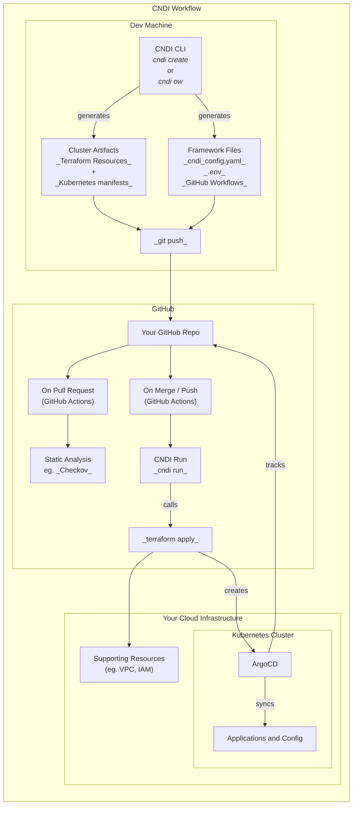

# CNDI – Self-Hosted Platform Engineering Made Easy

**CNDI** (Cloud-Native Deployment Infrastructure) is an open-source tool that
lets you set up full **platform engineering** environments – from infrastructure
to Kubernetes clusters and applications – with minimal effort. It provides a
holistic approach to cluster management, encompassing infrastructure
provisioning, application deployment, GitOps automation, and Day-2 operations.
In short, CNDI gives you the **ease-of-use of a PaaS** while you retain full
control of your stack in your own cloud or data center. 🚀

Developers and platform engineers can use CNDI to quickly provision
**production-ready** Kubernetes clusters _and_ deploy popular services on them
(like databases, analytics, or CI/CD tools) using a single unified
configuration. Everything is managed as code in a Git repository for
auditability and reproducibility. Let’s dive into what CNDI offers.

## Overview of CNDI

**What is CNDI?** CNDI stands for **Cloud-Native Deployment Infrastructure** and
is maintained by the Polyseam team. It’s essentially a CLI tool and framework
that automates the creation of Kubernetes-based platforms across multiple
environments. With CNDI you can:

- **Provision Infrastructure**: Set up cloud resources (VMs, networking, etc.)
  on AWS, GCP, Azure, or even locally, all defined via code.
- **Bootstrap a Kubernetes Cluster**: Install a Kubernetes distribution on those
  resources (e.g. a K3s cluster on your VMs) complete with essential add-ons
  (ingress, cert-manager, etc.).
- **Deploy Applications via GitOps**: Integrate Argo CD for GitOps so that your
  application manifests (Helm charts, YAMLs) are continuously deployed to the
  cluster from your git repo.
- **Bake in DevOps Best Practices**: Everything (infra and app configs) lives in
  a single Git repository – the one source of truth. Changes require git
  commits, ensuring traceability and easy rollbacks.
- **Include Observability & Security**: Out-of-the-box, CNDI clusters come with
  a full observability stack (Prometheus, Grafana, Loki) and enforce security
  via GitOps. It integrates cert-manager for TLS and sealed-secrets for managing
  secrets.

**Key Idea:** CNDI consolidates **Infrastructure-as-Code** and **GitOps** into
one workflow. Instead of managing Terraform for infra and Helm charts for apps
separately, you describe your desired state in one **`cndi_config.yaml`** file.
The CNDI CLI then generates the necessary Terraform and Kubernetes manifests
behind the scenes.

## Key Features and Benefits

- **🟢 Open Source & Community-Driven** – Apache-2.0 license, welcomes
  contributions, no proprietary lock-in.
- **🔧 Full-Stack Templates** – Blueprints for entire stacks (infra + cluster +
  apps) covering Airflow, Kafka, PostgreSQL, WordPress, etc.
- **📦 Complete Framework** – Infrastructure provisioning, GitOps CI/CD (Argo
  CD), monitoring, logging – all integrated.
- **🔒 Security & Auditability** – Git commits for all changes, secrets managed
  via `.env` and sealed-secrets, cert-manager for TLS.
- **🚀 Quick Interactive Setup** – CLI prompts guide you through project
  creation, even without deep Terraform/K8s knowledge.
- **🤖 GitHub Integration** – Auto-create GitHub repo and secrets, includes a
  GitHub Actions workflow (`cndi-run.yaml`).
- **♻️ Unified Config & One-Click Updates** – Edit `cndi_config.yaml` + run
  `cndi overwrite`, commit & push → everything regenerates.
- **📜 GitOps by Design** – Argo CD in-cluster watches your repo and
  continuously syncs state.
- **💠 Ejectability & Customization** – Generated Terraform and YAMLs are in
  your repo; you can extend or “eject” at any time.
- **🌐 Multi-Cloud & Hybrid Support** – AWS, GCP, Azure, and local `dev` mode,
  all with the same CLI and templates.
- **💰 Cost Efficiency** – Avoid managed-service markups; pay only for raw cloud
  resources. `cndi destroy` tears everything down when not needed.

## How CNDI Works (Architecture)



1. **Project Creation (Bootstrap)**
   - `cndi create` (interactive) → scaffolds a new Git repo with:
     - `cndi_config.yaml` (main config)
     - `.env` (secrets, not committed)
     - `cndi/` (generated Terraform & manifests)
     - `.github/workflows/cndi-run.yaml` (CI workflow)

2. **Overwrite (Generate Code)**
   - `cndi overwrite` reads your config/env and regenerates Terraform and K8s
     manifests in `cndi/`.

3. **GitOps Pipeline (Provision & Deploy)**
   - Push to GitHub → Actions runs `cndi run` → Terraform applies → cluster &
     infra up → Argo CD in-cluster pulls manifests → deploys apps.

4. **Day-2 Operations**
   - **Access** via domain/TLS or `kubectl port-forward`
   - **Monitor** with Grafana & Loki
   - **Update** by editing `cndi_config.yaml` → `cndi overwrite` → push →
     automated CI/CD
   - **Customize** by adding extra Terraform or manifests in config
   - **Destroy** everything with `cndi destroy` when done

## Installation

**Prerequisites:**

- GitHub CLI (`gh auth login`)
- Cloud credentials (AWS, GCP, Azure) or none for local `dev`
- (Optional) domain & email for TLS

**Install CNDI CLI:**

<details>
<summary>Mac/Linux</summary>

```bash
curl -fsSL https://raw.githubusercontent.com/polyseam/cndi/main/install.sh | sh
```

</details>

<details>
<summary>Windows (PowerShell)</summary>

```powershell
iwr https://raw.githubusercontent.com/polyseam/cndi/main/install.ps1 -UseBasicParsing | iex
```

</details>

Verify with:

```bash
cndi --version
```

## Quick Start Tutorial

Deploy **Airflow** on AWS in minutes:

1. **Create Project**
   ```bash
   cndi create my-user/my-airflow-demo -t airflow
   ```
   Follow prompts (cloud provider, region, nodes, domain, email…).

2. **Review & Adjust**\
   Edit `cndi_config.yaml` (e.g., node count, instance size).

3. **Generate Code**
   ```bash
   cndi overwrite
   git add .
   git commit -m "Initial CNDI config"
   git push origin main
   ```

4. **Watch CI**\
   In GitHub Actions, see **CNDI Run** deploy infra and cluster.

5. **Access Airflow**
   - Via domain/TLS if configured
   - Or use `kubectl port-forward`

6. **Next Steps**
   - Log into Argo CD (`admin` + password from `.env`)
   - Monitor via Grafana & Loki
   - Scale or add apps by editing config → `cndi overwrite` → push
   - Tear down with `cndi destroy`

## CNDI Templates and Use Cases

Popular templates:

| Template      | Use Case                        |
| ------------- | ------------------------------- |
| Airflow       | Data pipelines & ETL            |
| Kafka         | Event streaming                 |
| PostgreSQL    | SQL databases                   |
| MySQL         | SQL databases                   |
| MongoDB       | NoSQL database                  |
| Redis         | Cache / in-memory store         |
| WordPress     | CMS & web apps                  |
| Hop           | Visual data integration         |
| GPU Operator  | GPU workloads / ML              |
| Functions     | Serverless functions            |
| Neo4j         | Graph database                  |
| MS SQL Server | Containerized SQL Server on K8s |

- **Combine templates** in one `cndi_config.yaml` to deploy multiple stacks side
  by side.
- **Custom templates** are easy to create and share with the community.

## Comparison to Other Tools

- **DIY IaC + GitOps**: CNDI bundles Terraform, Argo CD, and CI, so you don’t
  start from scratch.
- **Managed K8s (EKS/GKE/AKS)**: CNDI uses self-managed clusters for cost and
  consistency across clouds.
- **Crossplane**: A framework to build platforms; CNDI is a ready-to-go platform
  with batteries included.
- **Kubefirst**: Similar instant GitOps platform installer; CNDI uses a
  single-repo, template-driven approach.
- **Backstage**: Developer portal UI; CNDI provides the automation backend. They
  can complement each other.
- **Commercial IDPs**: Humanitec, Port, etc., are paid and closed-source; CNDI
  is open-source and self-hosted.
- **Terraform/Pulumi**: Low-level IaC; CNDI generates Terraform for you and ties
  it into GitOps workflows.

## Why CNDI Deserves Your Attention

- **🌟 Simplified Platform Engineering** – From zero to a full platform in an
  afternoon.
- **🌟 Single Source of Truth** – All infra & apps in one Git repo with full
  auditability.
- **🌟 Production-Ready Out-of-the-Box** – Secure, monitored, GitOps flow from
  day one.
- **🌟 Flexibility & Control** – Sensible defaults with easy escape hatch via
  generated code.
- **🌟 Community & Knowledge Sharing** – Contribute templates and learn best
  practices.
- **🌟 Ideal for Small Teams & Startups** – No need for a large platform team to
  get started.
- **🌟 Future-Proof** – Community-maintained templates ensure alignment with
  best practices.

Give CNDI a try – spin up a template in your cloud of choice, and experience how
quickly you can go from code to cloud. Happy self-hosting! 🚀

---

## Further Resources

- **Official Site**: https://cndi.dev
- **GitHub Repo**: https://github.com/polyseam/cndi
- **Discord Community**: (Link on the official site)
- **Related Projects**:
  - Crossplane: https://crossplane.io
  - Kubefirst: https://kubefirst.io
  - Backstage: https://backstage.io
  - Argo CD: https://argo-cd.readthedocs.io
  - Terraform: https://www.terraform.io
