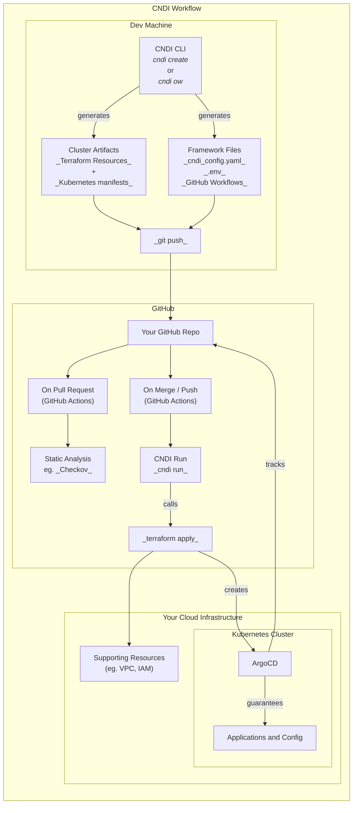

# CNDI – Self-Hosted Infrastructure Services in minutes

**CNDI** is a completely free and open-source framework for deploying and
managing cloud-native applications on Kubernetes in any environment. It provides
a holistic approach to cluster management, encompassing infrastructure
provisioning, application deployment, GitOps automation, and Day-2 operations.
In short, CNDI gives you the **ease-of-use of a PaaS** while you retain full
control of your stack in your own cloud with no license fees. 🚀

Developers can use CNDI to quickly provision **production-ready** Kubernetes
clusters _and_ deploy popular services on them (like databases, analytics, or
CI/CD tools) using a single unified configuration file. Everything is managed as
code in a single Git repository for auditability and reproducibility. You can
even create your own custom Templates, turning CNDI into a platform engineering
powerhouse.

If you like what you see, please check us out at
[https://cndi.dev](https://cndi.dev) and
[github.com/polyseam/cndi](https://github.com/polyseam/cndi)!

Let’s dive into what CNDI has to offer.

## Why CNDI Deserves Your Attention

With complete end-to-end control of your infrastructure, CNDI gives you the ease
of use you expect from a PaaS, coupled with the control, flexibility, and cost
savings of self-hosting.

- **🌟 Single Source of Truth** – All infra & apps in one Git repo with full
  auditability.
- **🌟 Production-Ready Out-of-the-Box** – Secure, monitored, GitOps flow from
  day one.
- **🌟 Flexibility & Control** – Sensible defaults and simple customization.
- **🌟 Entirely Free & Open Source** – Community maintained framework and
  Templates.

To get a sense of what CNDI and it's Templates can do for you, you can
experiment with our browser-based wizard at
[cndi.dev/configurator](https://cndi.dev/configurator)!

## Overview & Use Cases

**What is CNDI?** CNDI stands for **Cloud-Native Deployment Interface** and is a
cloud-native framework maintained by the Polyseam team alongside Open-Source
contributors. It automates the creation of Kubernetes-based infrastructure
platforms with unified support for every modern K8s environment.

With CNDI you can automatically:

- **Provision Infrastructure**: Set up cloud resources (VMs, networking, etc.)
  on AWS, GCP, Azure, or even locally, all defined via code.
- **Bootstrap your Kubernetes Cluster and Components**: Install a Kubernetes
  distribution on those infrastructure resources complete with essential add-ons
  (ingress, cert-manager, etc.).
- **Deploy Applications via GitOps**: Integrate ArgoCD for GitOps so that your
  application manifests (Helm charts, YAMLs) are continuously deployed to the
  cluster from your git repo.
- **Bake in DevOps Best Practices**: Everything (infra and app configs) lives in
  a single Git repository – the one source of truth. Changes require git
  commits, ensuring traceability and easy rollbacks.
- **Include Observability & Security**: Out-of-the-box, CNDI clusters come with
  a full observability stack (Prometheus, Grafana, Loki) and enforce security
  via GitOps. It integrates cert-manager for TLS and sealed-secrets for managing
  secrets.

**Key Idea:** CNDI consolidates **Infrastructure-as-Code** and **GitOps** into
one workflow. Instead of managing Terraform for infra and Helm charts for apps
separately, you describe your desired state in one **`cndi_config.yaml`** file.
The `cndi` CLI then generates the necessary Terraform and Kubernetes manifests
for your target deployment environment for you.

### Key Features & Benefits

- **🟢 Open Source & Community-Driven** – Apache-2.0 license, welcomes
  contributions, no proprietary lock-in.
- **🔧 Full-Stack Templates** – Blueprints for entire stacks (infra + cluster +
  apps) covering Airflow, Kafka, PostgreSQL, WordPress, etc.
- **📦 Complete Framework** – Infrastructure provisioning, GitOps CI/CD (Argo
  CD), monitoring, logging, secrets, ExternalDNS – all integrated.
- **🔒 Security & Auditability** – Git commits for all changes, secrets managed
  via `.env` and sealed-secrets, cert-manager for TLS.
- **🚀 Quick Interactive Setup** – CLI prompts guide you through project
  creation, even without deep Terraform/K8s knowledge.
- **🖥️ Online Configurator** - You can even play with configuring Templates
  online with the [cndi configurator](https://cndi.dev/configurator).
- **🤖 GitHub Integration** – Auto-create GitHub repo and secrets, includes a
  GitHub Actions workflow for deployments (`cndi-run.yaml`) and one for checks
  (`cndi_onpull.yaml`).
- **♻️ Unified Config & One-Click Updates** – Edit `cndi_config.yaml` + run
  `cndi overwrite`, commit & push → everything regenerates.
- **📜 GitOps by Design** – Argo CD in-cluster watches your repo and
  continuously syncs state.
- **💠 Ejectability & Customization** – Generated Terraform and YAMLs are in
  your repo; you can extend or “eject” at any time.
- **🌐 Multi-Cloud & Hybrid Support** – AWS, GCP, Azure, and local `dev` mode,
  all with the same CLI and Templates.
- **💰 Cost Efficiency** – Avoid managed-service markups; pay only for raw cloud
  resources. `cndi destroy` tears everything down when not needed.

### Templates

CNDI comes with a variety of **pre-built templates** for common use cases. These
Templates are designed to be production-ready and can be easily customized to
fit your needs. Each Template includes a complete stack of infrastructure,
Kubernetes cluster, and applications, all defined in a single `cndi_config.yaml`
file. This allows you to quickly spin up a fully functional environment with
minimal effort, and when you need to make changes, you can do so by simply
editing that same file and running `cndi overwrite`.

Popular Templates:

| Template                                                | Use Case                        |
| ------------------------------------------------------- | ------------------------------- |
| [Airflow](https://cndi.dev/templates/airflow)           | Data pipelines & ETL            |
| [Kafka](https://cndi.dev/templates/kafka)               | Event streaming                 |
| [PostgreSQL](https://cndi.dev/templates/postgres)       | SQL databases                   |
| [MySQL](https://cndi.dev/templates/mysql)               | SQL databases                   |
| [MongoDB](https://cndi.dev/templates/mongodb)           | NoSQL database                  |
| [Redis](https://cndi.dev/templates/redis)               | Cache / in-memory store         |
| [WordPress](https://cndi.dev/templates/wordpress)       | CMS & web apps                  |
| [Hop](https://cndi.dev/templates/hop)                   | Visual data integration         |
| [GPU Operator](https://cndi.dev/templates/gpu-operator) | GPU workloads / ML              |
| [Functions](https://cndi.dev/templates/fns)             | Serverless functions            |
| [Neo4j](https://cndi.dev/templates/neo4j)               | Graph database                  |
| [MS SQL Server](https://cndi.dev/templates/mssqlserver) | Containerized SQL Server on K8s |

- Don't forget **Custom Templates** are easy to create and share with the
  community!

## How CNDI Works (Architecture)

<details>
  <summary><h3>Diagram</h3></summary>



</details>

## Developer Experience

1. **Project Creation (Bootstrap)**
   - `cndi create` (interactive) → scaffolds a new Git repo with:
     - `cndi_config.yaml` (main config)
     - `.env` (secrets, not committed)
     - `cndi/terraform/*` (generated Terraform)
     - `cndi/cluster_manifests/*` (generated K8s manifests)
     - `.github/workflows/cndi-run.yaml` (CI workflow)
     - `.github/workflows/cndi_onpull.yaml` (CI checks workflow)

2. **Overwrite (Generate Code)**
   - `cndi overwrite` reads your `cndi_config.yaml` and `.env` and regenerates
     Terraform and Kubernetes manifests in `cndi/`.

3. **GitOps Pipeline (Provision & Deploy)**
   - Push to GitHub → Actions runs `cndi run` → Terraform applies → cluster &
     infra up → Argo CD in-cluster pulls manifests → deploys apps.

4. **Day-2 Operations**
   - **Access** via domain/TLS
   - **Monitor** with Prometheus, Grafana, & Loki
   - **Update** by editing `cndi_config.yaml` → `cndi overwrite` → push →
     automated CI/CD
   - **Customize** by adding extra Terraform or manifests in config
   - **Destroy** everything with `cndi destroy` when done

## Installation

**Prerequisites:**

- GitHub CLI (`gh auth login`)
- Cloud credentials (AWS, GCP, Azure) or none for local `dev`
- (Optional) domain & email for TLS

Once you have what you need, install CNDI using the guide from the
[Project's README.md](https://cndi.run/gh?utm_source=c2cPE).

## Quick Start Tutorial

Deploy **Airflow** on your cloud in minutes:

1. **Create Project**
   ```bash
   cndi create my-user/my-airflow-demo -t airflow
   ```
   Follow prompts (cloud provider, region, nodes, domain, email…).

2. **Open GitHub Repo**
   ```bash
   gh repo view my-user/my-airflow-demo --web
   ```

3. **Watch CI**\
   In GitHub Actions, see **CNDI Run** deploy infra and cluster.

4. **Access Airflow**
   - Via domain/TLS if configured
   - Or use `kubectl port-forward`

5. **Next Steps**
   - Log into Argo CD (`admin` + password from `.env`)
   - Monitor via Grafana & Loki
   - Scale or add apps by editing config → `cndi overwrite` → push
   - Tear down with `cndi destroy`

## Further Resources

- **Official Site**: https://cndi.dev
- **GitHub Repo**: https://github.com/polyseam/cndi
- **Discord Community**: https://cndi.run/di?utm_source=c2cPE
- **Related Projects**:
  - Argo CD: https://argo-cd.readthedocs.io
  - Terraform: https://www.terraform.io
  - GitHub Actions: https://github.com/features/actions
  - Prometheus: https://prometheus.io
  - Grafana: https://grafana.com
  - Loki: https://grafana.com/oss/loki
  - Cert-Manager: https://cert-manager.io
  - Sealed Secrets: https://github.com/bitnami-labs/sealed-secrets
  - Checkov: https://www.checkov.io
  - Helm: https://helm.sh
