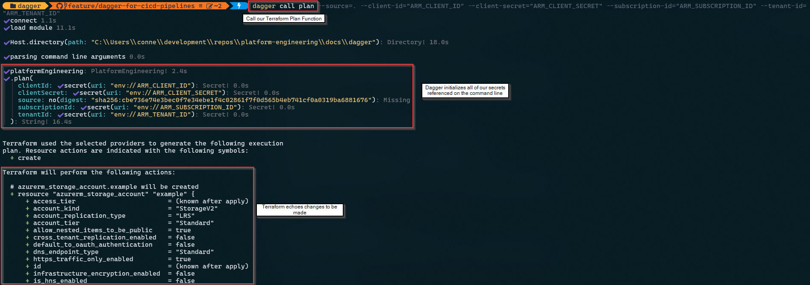

# 🚀 Using Dagger for Reusable, Portable CI/CD Pipelines

Hey there, Platform Engineers! 👷‍♀️👷‍♂️

Welcome to the documentation on [Dagger](https://docs.dagger.io/), an **open-source runtime for composable workflows**. But what does that mean exactly? Dagger is very intriguing if you think about the current developer workflow for CI/CD pipelines. Using something like GitHub Actions, we need to define a YAML template (and we all know how much developers love YAML 😉) and push it as many times to source control as it takes to get a initial CI/CD pipeline working.

There are many factors that play into why this is challenging. To name one, the workflow agent (ie: the compute running the pipeline) where the CI/CD pipeline will run is very likely not the same as the environment you develop in, leading to ‘dependency hell’. Debugging is painful since you often have to test by pushing your code, waiting for it to run, and then troubleshooting errors from logs, making more changes, waiting again for the pipeline to run and the cycle repeats itself. This slow feedback loop makes iterations cumbersome. Additionally, declarative pipeline definitions, while powerful, can be limiting when handling complex logic, and there’s often no straightforward way to test them locally before deployment.

This is where Dagger comes in to save the day 🦸. In Dagger, CI/CD pipelines are containerized, making them incredibly portable. They run the same way locally as they do in the cloud, eliminating environmental inconsistencies. By enabling developers to run pipelines locally before committing changes, Dagger provides immediate feedback, significantly reducing the time spent debugging and improving development efficiency.

From the creators of Docker, let’s have a look at how Dagger works in practice.

## 🏗️ Introduction to Dagger’s Approach to CI/CD as Code

As mentioned above, Dagger is an **open-source runtime for composable workflows**, designed to create **repeatable, modular, observable, and cross-platform CI/CD pipelines**. By defining CI/CD workflows as code, Dagger enables:

✅ **Reusable Workflows** – Define once, use anywhere across projects and teams.

✅ **Portable Execution** – Run workflows **locally, in any CI system, or in the cloud** without modifications.

✅ **Optimized Performance** – Leverage **automatic artifact caching** for efficient execution.

✅ **Built-in Observability** – Gain real-time insights via **logs, tracing, and metrics**.

Since Dagger leverages containers, what runs locally will be the same as what runs in the cloud (ie: GitHub Actions). This solves a huge challenge for developers and makes the writing, testing, and deployment of CI/CD pipelines much easier. Dagger is also platform agnostic allowing you to switch platforms as needed, avoiding CI lock-in.

---

## 📌 Dagger Components Overview

The **Dagger Engine** is the core runtime, responsible for executing workflows using a **universal type system** and **data layer**. It runs on any OCI-compatible system and is controlled via the Dagger API. Dagger has the following key components:

- **Dagger Engine**: The core runtime that powers Dagger pipelines.
- **Dagger SDKs**: Use Python, Go, or Node.js to define pipelines.
- **Containerized Execution**: Each step runs in an isolated, reproducible environment.
- **Dagger API**: A GraphQL-based universal type system for defining workflows.
- **DaggerVerse**: An easy way to search and consume modules.
- **LLM Prompting**: Dagger allows you to interact with various LLMs and chain together complex tasks.

---

## 🤖 Dagger & Generative AI

An AI agent is an automated program that is using an LLM with a set of functions you define, that the LLM can call on demand depending on what is needed. The cool part about combining AI agents with Dagger is the agents can call any API that is apart of the Dagger API.

Dagger exposes an `LLM` core type which enables developers to interact with LLMs and send prompts and receive information back. Dagger supports integration with several LLM providers including OpenAI, Ollama, Anthropic, and the new Docker Model Runner.

The `LLM` type exposes a few functions that are handy to interact with LLMs and they boil down into the following categories:

- Prompts
- Responses and Variables
- Environments

### 📃 Prompts

The `LLM.withPrompt()` method allows you to send a prompt to a LLM. Similarly, `LLM.withPromptFile()` enables you to read a prompt from a file and send it to an LLM. This is handy if you want to tie into a version controlled prompt in your repository.

### 🗣️ Responses and Variables

The `LLM.lastReply()` API method allows you to obtain the last reply from the LLM.

Both variables and `LLM.lastReply()` enable developers to store results of previous operations and pass them to an LLM prompt. This is very powerful when we start dealing with things like agents.

You can also get a complete message history from LLM calls via `LLM.History()`.

### 🧰 Environments

**Environments** unlocks the ability for LLMs to call Dagger Functions as tools. This is a common pattern with agentic applications where you basically give an LLM access to a series of tools that the LLM can select to perform an action. A tool could be a custom integration with Gmail to send an email, or an API call to a weather service.

### Wrapping Up

This is cool that Dagger can integrate with LLMs but what does this mean from a use case perspective?

Dagger has published plenty of [examples](https://docs.dagger.io/examples/) in their documentation you can checkout to demonstrate the art of the possible.

We have also done up an example below where an AI agent in Dagger reviews a Terraform Plan, provides feedback, and adds comments to a PR.

Check it out [here](https://github.com/codetocloudinc/platform-engineering/tree/main/docs/dagger#-real-world-example-dagger-agents-and-terraform)!

---

## 🌍 Real-World Example: Deploying Terraform with Dagger

In the below example, we will create a Dagger pipeline that will deploy some Terraform code and we will see how useful being able to run CI/CD pipelines locally makes the development process.

### 🎯 Expected Outcome of 'Deploying Terraform with Dagger'

✅ Terraform initializes and validates the configuration.

✅ Infrastructure is provisioned automatically.

✅ The same pipeline can be executed locally or in CI/CD environments without modification.

### 🔨 Implementation of 'Deploying Terraform with Dagger'

The below steps were taken to implement a CI/CD pipeline in Dagger that deploys Terraform. All the code for the below can be found [here](https://github.com/codetocloudinc/platform-engineering/tree/main/docs/dagger/terraform-example)

Make sure you have installed the [Dagger CLI](https://docs.dagger.io/ci/quickstart/cli/), the repo is cloned and you are in the dagger directory:

```bash
# Clone the repository from GitHub
git clone https://github.com/codetocloudinc/platform-engineering.git

# Change directory to the Terraform Dagger pipeline documentation folder
cd ./docs/dagger/terraform-example
```

#### Step 1: Create Terraform Files

First, we need to create the base Terraform configuration file that will deploy an Azure Blob Storage Account to an existing resource group. This will be our main.tf file in the root of the dagger folder.

```terraform
terraform {
  required_providers {
    azurerm = {
      source  = "hashicorp/azurerm"
      version = "4.23.0"
    }
  }
}

provider "azurerm" {
  resource_provider_registrations = "none"
  features {}
}

resource "azurerm_storage_account" "example" {
  name                     = "daggertestingsa123"
  resource_group_name      = "dagger"
  location                 = "West US"
  account_tier             = "Standard"
  account_replication_type = "LRS"
}
```

Lets Daggerize this Terraform file!

#### Step 2: Initialize Dagger 🧑‍💻🗡️

Inside of the same Dagger directory, we are going to run a few Dagger CLI commands to get going:

```bash
# Initialize a new module at the given path
dagger init --sdk=python --source=./terraform_dagger_pipeine --name=platform_engineering
```

The above Dagger CLI command called `init` initializes the new module, and you will note we are passing through a few command line arguments:

- sdk: dagger makes available a few SDKs. They have support for Go, Python, TypeScript, PHP, and Java. In this case, we are using Python.
- source: source directory used by the installed sdk. In our case, we are asking Dagger to initialize in the ./terraform_dagger_pipeine directory
- name: name of the new module

All this together will create a new directory in our Dagger folder called ‘terraform_dagger_pipeine’ with some default configurations.

To get this working for our use case and deploy some Terraform code, we will need to make some configuration changes.

#### Step 3: Update the Dagger Configuration ⚙️

In the main.py file that was generated by the Dagger CLI (locate at: docs\dagger\terraform-example\terraform_dagger_pipeine\src\platform_engineering\main.py), we need to make some configuration changes to deploy our Terraform code. Before we do that, there are a few key concepts we need to understand. As mentioned earlier, we are going to deploy some Terraform code against an Azure resource group. There are a few things we need to consider to do this successfully.

**Things to consider** 🤔

- How will we securely store our secrets to authenticate to Azure?
- How will we provide Dagger the ability to run Terraform?

We can solve the first challenge by using **[Dagger Secrets](https://docs.dagger.io/features/secrets)**. Let's briefly explore how Dagger manages sensitive credentials securely.

**Using Secrets in Dagger** 🔒

Dagger supports the use of confidential information, such as passwords, API keys, SSH keys, access tokens, and other sensitive data in your pipelines. Instead of exposing secrets in environment variables or configuration files, Dagger provides built-in secret management, allowing us to:

- Store secrets securely in the host environment.
- Read secrets from files on the host system.
- Fetch secrets dynamically from external providers like 1Password and Vault.

For our use case, we will store Azure authentication credentials (client_id, client_secret, subscription_id, tenant_id) as Dagger secrets and inject them securely into our Terraform container. For local testing, you can set environment variables in your terminal. For example, in PowerShell, you can set the necessary environment varibales to execute Terraform like so:

```powershell
$ENV:ARM_TENANT_ID = "your_tenant_id"                        
$ENV:ARM_CLIENT_ID = "your_client_id"
$ENV:ARM_CLIENT_SECRET = "your_client_secret"                          
$ENV:ARM_SUBSCRIPTION_ID = "your_subscription_id"  
```

**Running Terraform with Daggers Containerized Approach** 🏗️

As for the challenge around 'How will we provide Dagger the ability to run Terraform?':

Since Dagger executes workflows in containers, we don’t need to install Terraform on our local machine or the CI/CD runner. Instead, we use the official hashicorp/terraform container image to ensure a consistent runtime environment. This approach provides several benefits:

✅ Eliminates Local Setup Hassles – No need to install or manage Terraform versions manually.

✅ Ensures Environment Consistency – The same Terraform version runs in development and CI/CD.

By leveraging Dagger’s containerized execution, we can run Terraform commands (`init`, `plan`, `apply`) inside a predefined, reproducible environment. This makes our pipeline more portable, repeatable, and platform-agnostic. 🚀

**Dagger Python Implementation** ⚒️

Here’s how we modify main.py to leverage Dagger Secrets and a Terraform Docker image to execute our Terraform:

```python
from typing import Annotated
import dagger
from dagger import dag, function, object_type, Doc, Secret


@object_type
class PlatformEngineering:
    @function
    async def plan(
        self,
        source: dagger.Directory,
        client_id: Annotated[dagger.Secret, Doc("Azure Client ID")],
        client_secret: Annotated[dagger.Secret, Doc("Azure Client Secret")],
        subscription_id: Annotated[dagger.Secret, Doc("Azure Subscription ID")],
        tenant_id: Annotated[dagger.Secret, Doc("Azure Tenant ID")],
    ) -> str:
        """
        Runs `terraform plan` using Azure credentials stored as secrets.

        This function executes Terraform inside a container, securely passing in Azure authentication credentials.
        It returns the Terraform plan output for review.
        """
        return await self.run_terraform("plan", source, client_id, client_secret, subscription_id, tenant_id)

    @function
    async def apply(
        self,
        source: dagger.Directory,
        client_id: Annotated[dagger.Secret, Doc("Azure Client ID")],
        client_secret: Annotated[dagger.Secret, Doc("Azure Client Secret")],
        subscription_id: Annotated[dagger.Secret, Doc("Azure Subscription ID")],
        tenant_id: Annotated[dagger.Secret, Doc("Azure Tenant ID")],
    ) -> str:
        """
        Runs `terraform apply` to apply the planned changes using Azure authentication.

        This function first ensures Terraform is initialized, then executes the apply step.
        The execution is done inside a container, securely injecting the necessary secrets.
        """
        return await self.run_terraform("apply", source, client_id, client_secret, subscription_id, tenant_id)

    async def run_terraform(
        self,
        command: str,
        directory_arg: dagger.Directory,
        client_id: dagger.Secret,
        client_secret: dagger.Secret,
        subscription_id: dagger.Secret,
        tenant_id: dagger.Secret,
    ) -> str:
        """
        Runs Terraform (`plan` or `apply`) with Azure authentication.

        - Mounts the Terraform directory inside a Dagger container.
        - Injects Azure credentials securely as environment variables.
        - Executes Terraform commands (`terraform init`, then `terraform plan` or `terraform apply`).
        """
        terraform_command = ["terraform", command]
        
        # Add auto-approve if it's an apply command
        if command == "apply":
            terraform_command.append("-auto-approve")

        container = (
            dag.container()
            .from_("hashicorp/terraform:1.11")  # Use official Terraform image
            .with_mounted_directory("/mnt", directory_arg)
            .with_workdir("/mnt")
            .with_secret_variable("ARM_CLIENT_ID", client_id)
            .with_secret_variable("ARM_CLIENT_SECRET", client_secret)
            .with_secret_variable("ARM_SUBSCRIPTION_ID", subscription_id)
            .with_secret_variable("ARM_TENANT_ID", tenant_id)
            .with_exec(["terraform", "init"])
            .with_exec(terraform_command)
        )
        return await container.stdout()
```

**How This Works** 🔍  

1️⃣ **Securely Injecting Secrets** 🔑

- Instead of using plain environment variables, we pass Azure credentials as **Dagger secrets** (`dagger.Secret`).  
- This ensures that sensitive values (Client ID, Secret, Subscription ID, Tenant ID) are **never exposed in logs** or outputs.  
- The secrets are securely injected into the container as environment variables when running Terraform.  

2️⃣ **Mounting the Terraform Directory** 📂

- The **Terraform configuration files** (stored in `source: dagger.Directory`) are mounted inside the container at `/mnt`.  
- This allows Terraform to **access all necessary files** while keeping everything **isolated and reproducible**.  

3️⃣ **Executing Terraform Inside a Container** 🚀

- The pipeline runs Terraform **inside a containerized environment** using the official `hashicorp/terraform:1.11` Docker image.
- Dagger exposes a type called `Container` that represents the state of an OCI-compatible (ie: Docker) container. This is passed to the Dagger Engine and is passed to a Dagger Function's code as if it were just another variable.
- It performs the following steps:  

  - Initializes Terraform with `terraform init`
  - Runs either `terraform plan` (for previewing changes) or `terraform apply` (to make changes live)
  - For `apply`, we add the `-auto-approve` flag to **automate the process**  

By using **Dagger**, we ensure that Terraform runs **consistently across different environments**, whether on a local machine or in a CI/CD system.

Now, let’s test it locally before pushing it to GitHub! 🚀

#### Step 4: Running the Dagger Pipeline Locally 🧑‍💻

To execute our Dagger pipeline locally, we can leverage the Dagger CLI again this time using the `call` command. This will call one or more functions, interconnected into a pipeline. In thise case, we are calling our `plan` function defined above in our main.py file. This will run a Terraform plan for us that will echo the changes to be made in our Azure resource group. In this case, a new blob storage account.

```bash
dagger call plan --source=. --client-id="ARM_CLIENT_ID" --client-secret="ARM_CLIENT_SECRET" --subscription-id="ARM_SUBSCRIPTION_ID" --tenant-id="ARM_TENANT_ID"
```

You will note we are passing through a few command line arguments being used here:

- source: source directory used by the installed sdk. In our case, we are asking Dagger to initialize in the ./terraform_dagger_pipeine directory
- env vars: all of the required environment variables to enable Terraform to connect to Azure

The output of that command will be similar to the below:



The output of the plan is looking good and has all the changes I would expect based on our Terraform file. Instead of running the apply locally, lets get our existing functionality into GitHub actions and run our pipeline there!

#### Step 5: Running our Dagger Pipeline in GitHub Actions 🐙

Now that we have successfully executed our Dagger pipeline locally, it's time to automate it in a CI/CD environment. This will ensure that our Terraform deployments are consistently executed whenever code is pushed to our repository.

We will use GitHub Actions to automate the execution of our Dagger pipeline. Below is a sample workflow file that runs Terraform inside our Dagger container whenever changes are pushed to the repository (the location of this file is .github\workflows\dagger_terraform.yml).

```yaml
name: dagger_terraform  # Name of the workflow

on:
  push:
    branches: [main]  # Trigger workflow on pushes to this branch

jobs:
  dagger-plan:
    runs-on: ubuntu-latest  # Define the runner environment

    env:
      # Set Azure authentication secrets as environment variables
      ARM_CLIENT_ID: ${{ secrets.DAGGER_ARM_CLIENT_ID }}
      ARM_CLIENT_SECRET: ${{ secrets.DAGGER_ARM_CLIENT_SECRET }}
      ARM_SUBSCRIPTION_ID: ${{ secrets.ARM_SUBSCRIPTION_ID }}
      ARM_TENANT_ID: ${{ secrets.ARM_TENANT_ID }}

    steps:
      - name: Checkout repository  # Fetch the repository code
        uses: actions/checkout@v4

      - name: Install Dagger CLI  # Download and install the Dagger CLI
        run: |
          curl -fsSL https://dl.dagger.io/dagger/install.sh | BIN_DIR=$HOME/.local/bin sh
          echo "$HOME/.local/bin" >> $GITHUB_PATH  # Add Dagger to the system PATH

      - name: Run Dagger plan  # Execute the Dagger plan command
        working-directory: docs/dagger
        run: |
          dagger call plan --source=. \
            --client-id=ARM_CLIENT_ID \
            --client-secret=ARM_CLIENT_SECRET \
            --subscription-id=ARM_SUBSCRIPTION_ID \
            --tenant-id=ARM_TENANT_ID

  dagger-apply:
    runs-on: ubuntu-latest  # Define the runner environment
    needs: [dagger-plan]  # Ensure 'dagger-plan' job completes before running this job
    environment: dagger_prod  # Use the 'dagger_prod' environment

    env:
      # Set Azure authentication secrets as environment variables
      ARM_CLIENT_ID: ${{ secrets.DAGGER_ARM_CLIENT_ID }}
      ARM_CLIENT_SECRET: ${{ secrets.DAGGER_ARM_CLIENT_SECRET }}
      ARM_SUBSCRIPTION_ID: ${{ secrets.ARM_SUBSCRIPTION_ID }}
      ARM_TENANT_ID: ${{ secrets.ARM_TENANT_ID }}

    steps:
      - name: Checkout repository  # Fetch the repository code
        uses: actions/checkout@v4

      - name: Install Dagger CLI  # Download and install the Dagger CLI
        run: |
          curl -fsSL https://dl.dagger.io/dagger/install.sh | BIN_DIR=$HOME/.local/bin sh
          echo "$HOME/.local/bin" >> $GITHUB_PATH  # Add Dagger to the system PATH

      - name: Run Dagger apply  # Execute the Dagger apply command
        working-directory: docs/dagger
        run: |
          dagger call apply --source=. \
            --client-id=ARM_CLIENT_ID \
            --client-secret=ARM_CLIENT_SECRET \
            --subscription-id=ARM_SUBSCRIPTION_ID \
            --tenant-id=ARM_TENANT_ID
```

This workflow ensures that infrastructure changes are reviewed before they are applied. The `dagger-plan` job runs first and outputs the Terraform plan. Once someone reviews the plan, they can approve the exection of the `dagger-apply` job. The `dagger-apply` step uses a protected environment (`dagger_prod`) to ensure deployments follow a controlled process.

After running the apply, an Azure Blob Storage Account will be deployed to your resource group! 🎉

#### 🎯 Final Outcome of 'Deploying Terraform with Dagger'

✅ Every push to `main` will trigger a Terraform plan.

✅ Changes to infrastructure are reviewed before applying.

✅ The main branch automatically provisions infrastructure using Terraform.

✅ An Azure Blob Storage Account is deployed.

By integrating our Dagger pipeline into GitHub Actions, we ensure that our Terraform deployment process is efficient, repeatable, and secure! 🎉

---

## 🌍 Real-World Example: Dagger Agents and Terraform

In the below example, we will create a Dagger pipeline that will run a Terraform plan, have an AI agent provide feedback from a security and best practices standpoint, and append that feedback to a PR for review.

### 🎯 Expected Outcome of 'Dagger Agents and Terraform'

✅ Terraform initializes and runs a plan.

✅ AI agent validates and provides feedback on Terraform Plan.

✅ AI agent findings are appended to the PR for review.

✅ View traces in **Dagger Cloud**.

✅ Faster PR review times.

### 🔨 Implementation of 'Dagger Agents and Terraform'

The below steps were taken to leverage Daggers LLM integration capabilities. All the code for the below can be found [here](https://github.com/codetocloudinc/platform-engineering/tree/main/docs/dagger/ai_agent_dagger_pipeline).

Make sure you have installed the [Dagger CLI](https://docs.dagger.io/ci/quickstart/cli/), the repo is cloned and you are in the dagger directory:

```bash
# Clone the repository from GitHub
git clone https://github.com/codetocloudinc/platform-engineering.git

# Change directory to the AI Agent Dagger pipeline documentation folder
cd ./docs/dagger/ai_agent_dagger_pipeline
```

#### Step 1: Create Intentionally Poor Terraform File

First, we need to create the base Terraform configuration file that will deploy an Azure Blob Storage Account and a container to an existing resource group. This will be our main.tf file in the root of the dagger folder.

```terraform
terraform {
  required_providers {
    azurerm = {
      source  = "hashicorp/azurerm"
      version = "4.26.0"
    }
  }
}

provider "azurerm" {
  resource_provider_registrations = "none"
  features {}
}

resource "azurerm_storage_account" "example" {
  name                     = "daggertestingsa123"
  resource_group_name      = "dagger" # 🔴 Hardcoded RG name
  location                 = "East US"
  account_tier             = "Standard"
  account_replication_type = "LRS"

  https_traffic_only_enabled = false # 🔴 Insecure: allows HTTP

  public_network_access_enabled = true # 🔴 Open to the internet

  network_rules {
    default_action = "Allow"       # 🔴 Very permissive
    ip_rules       = ["0.0.0.0/0"] # 🔴 Everyone has access
    bypass         = ["AzureServices"]
  }

  tags = {
    environment = "test" # 🔴 Incomplete tagging, no owner/security tags
  }
}

resource "azurerm_storage_container" "public_container" {
  name                  = "public"
  storage_account_id    = azurerm_storage_account.example.id
  container_access_type = "blob" # 🔴 Public anonymous read access
}
```

You will notice in the comments we have intentionally added some poor Terraform practices into our code. This is to test the capability of the AI agent and see if it is able to flag them.

For example, we have set our container to public access with anonymous read access. This means anyone on the public internet can read the files in that container anonymously 😬.

Lets Daggerize this Terraform file!

#### Step 2: Initialize Dagger for our AI Agent 🤖🗡️

Similar to the first [real-world example](https://github.com/codetocloudinc/platform-engineering/tree/main/docs/dagger#-real-world-example-deploying-terraform-with-dagger) where we Daggerized a Terraform file, we have to do the same here to get going.

The only difference here is we will login to the **Dagger Cloud** which provides us with a a web interface to visualize each step of your workflow, drill down to detailed logs, understand how long operations took to run, and whether operations were cached.

This is very handy for AI agents since they can be notoriously challenging to troubleshoot. More on Dagger Cloud later!

```bash
# Initialize a new module at the given path
dagger init --sdk=python --name=agent_example --source=./ai_agent_dagger_pipeline

# Login to Dagger Cloud
dagger login
```

This will create our new Dagger project and link it to the cloud.

#### Step 3: Implement our AI Agent ⚙️

In the main.py file that was generated by the Dagger CLI (locate at: docs\dagger\agent-example\ai_agent_dagger_pipeline\src\agent_example\main.py), we need to make some code changes to get our AI agent working. As mentioned earlier, we are going to have an AI agent assess our Terraform Plan file to identify any opportunities for improvement. In theory this should assist the PR reviewer since the AI agent is essentially summarizing/doing what a good PR reviewer should be doing prior to approving it.

In the code below you will notice two functions:

1. `comment_on_pr()` – adds the AI agent output as a comment on a PR
2. `terraform_agent()` – The AI agent implemented in Dagger. The agent has access to one tool called ‘terraform_runner’ which runs on a Terraform docker image and enables the agent to run Terraform commands like init and plan.

The code below is commented to assist you in understanding the implementation.

**Dagger AI Agent Python Implementation** 🤖⚒️

```python
import dagger
from dagger import dag, function, object_type

@object_type
class AgentExample:
    """
    Dagger object representing an example agent that can:
    - Comment on a GitHub pull request.
    - Execute a Terraform job in a containerized environment and analyze its output.
    """

    async def comment_on_pr(
        self,
        repo: str,
        comment_body: str,
        github_token: dagger.Secret,
    ) -> str:
        """
        Comments on the latest pull request authored by the authenticated user in the specified GitHub repository.

        Args:
            repo (str): The GitHub repository in the format 'owner/repo'.
            comment_body (str): The text content of the comment to post.
            github_token (dagger.Secret): GitHub personal access token with repo permissions.

        Returns:
            str: The standard output from the container after commenting.
        """
        container = (
            dag.container()
            .from_("alpine:latest")
            .with_secret_variable("GITHUB_TOKEN", github_token)
            # Install required tools
            .with_exec(["apk", "add", "--no-cache", "curl", "bash", "git", "openssl"])
            # Download and install GitHub CLI (gh)
            .with_exec([
                "sh", "-c",
                (
                    "curl -fsSL https://github.com/cli/cli/releases/download/v2.70.0/gh_2.70.0_linux_amd64.tar.gz "
                    "| tar -xz && mv gh_2.70.0_linux_amd64/bin/gh /usr/local/bin/"
                )
            ])
            # Clone the specified GitHub repository
            .with_exec(["git", "clone", f"https://github.com/{repo}.git"])
            # Set the working directory to the cloned repo
            .with_workdir(repo.split("/")[-1])
            # Create a temporary markdown file with the comment
            .with_new_file("/tmp/comment.md", contents=comment_body)
            # Post a comment on the latest PR authored by the user
            .with_exec([
                "sh", "-c",
                (
                    "PR_NUMBER=$(gh pr list --author \"@me\" --limit 1 --json number --jq '.[0].number') && "
                    f"gh pr comment $PR_NUMBER --body-file /tmp/comment.md --repo {repo}"
                )
            ])
        )

        # Return container output (e.g., result or logs)
        return await container.stdout()

    @function
    async def terraform_agent(
        self,
        assignment: str,
        directory_arg: dagger.Directory,
        client_id: dagger.Secret,
        client_secret: dagger.Secret,
        subscription_id: dagger.Secret,
        tenant_id: dagger.Secret,
        github_token: dagger.Secret
    ) -> str:
        """
        Executes a Terraform job using credentials and a directory of Terraform configurations,
        then comments the AI-analyzed result on a GitHub PR.

        Args:
            assignment (str): Description or title of the assignment.
            directory_arg (dagger.Directory): Directory containing the Terraform configuration.
            client_id (dagger.Secret): Azure client ID for Terraform.
            client_secret (dagger.Secret): Azure client secret for Terraform.
            subscription_id (dagger.Secret): Azure subscription ID for Terraform.
            tenant_id (dagger.Secret): Azure tenant ID for Terraform.
            github_token (dagger.Secret): GitHub token for posting the comment.

        Returns:
            str: The final analyzed result of the Terraform job.
        """
        # Set up the environment for Terraform execution
        environment = (
            dag.env()
            .with_string_input("assignment", assignment, "the assignment to complete")
            .with_container_input(
                "terraform_runner",
                dag.container()
                    .from_("hashicorp/terraform:1.11")
                    .with_mounted_directory("/mnt", directory_arg)
                    .with_workdir("/mnt")
                    .with_secret_variable("ARM_CLIENT_ID", client_id)
                    .with_secret_variable("ARM_CLIENT_SECRET", client_secret)
                    .with_secret_variable("ARM_SUBSCRIPTION_ID", subscription_id)
                    .with_secret_variable("ARM_TENANT_ID", tenant_id)
                    # Initialize and plan Terraform configuration
                    .with_exec(["terraform", "init"])
                    .with_exec(["terraform", "plan"]),
                "a container to use for running the terraform init & plan"
            )
            .with_container_output(
                "completed", "the completed assignment in the Terraform container"
            )
        )

        # Use an LLM to analyze the Terraform results
        analyze_results = (
            dag.llm()
            .with_env(environment)
            .with_prompt_file(dag.current_module().source().file("terraformer.txt"))
        )

        # Comment the LLM's last reply on a GitHub pull request
        await self.comment_on_pr("codetocloudinc/platform-engineering", await analyze_results.last_reply(), github_token)

        # Return the analyzed result
        return await analyze_results.last_reply()
```

**How This Works** 🤖✨

1️⃣ **Automated GitHub PR Commenting** 🗨️

- The `comment_on_pr` function uses the **GitHub CLI (`gh`) inside a container** to programmatically **comment on the latest pull request** authored by the user.
- It starts from a minimal `alpine` base image and installs necessary tools (`curl`, `bash`, `git`, `openssl`) as well as the **GitHub CLI**.
- The container:
  - Clones the specified GitHub repo.
  - Searches for the most recent PR opened by the user using `gh pr list`.
  - Posts the provided comment (`comment_body`) via `gh pr comment`.
- A `dagger.Secret` is used to securely inject the **GitHub token**, ensuring it's **never exposed in logs**.

2️⃣ **Containerized Terraform Execution with AI Review** 🤯🛠️

- The `terraform_agent` function executes a Terraform job inside a container and then uses an LLM to **analyze the results**.
- It builds a specialized `hashicorp/terraform:1.11` container to:
  - Mount the user-provided Terraform config directory at `/mnt`
  - Inject all necessary **Azure credentials** (`ARM_CLIENT_ID`, `ARM_CLIENT_SECRET`, `ARM_SUBSCRIPTION_ID`, `ARM_TENANT_ID`) securely using Dagger secrets.
  - Run `terraform init` and `terraform plan` to **preview infrastructure changes**.
- All steps happen in an **isolated, reproducible container**, making it consistent across developer machines and CI/CD systems.

3️⃣ **AI-Powered Output Interpretation** 🧠📋

- The output of the Terraform plan is passed to an **LLM environment**, which:
  - Uses a predefined `terraformer.txt` prompt template.
  - Generates a **natural language summary or analysis** of the Terraform output.
- Finally, the AI-generated summary is **posted as a comment** on a GitHub pull request using the earlier `comment_on_pr` function.
- This provides a **human-readable, intelligent insight** into the changes proposed by the Terraform config—right inside your GitHub workflow.

#### Step 4: Running the Dagger AI Agent Locally 🤖🧑‍💻

To make sure this all works, we have to set a few environment variables in our terminal. This will allow our Dagger agent to interact with Azure to generate our Terraform plan and GitHub to create a comment on an existing PR.

```powershell
$ENV:ARM_TENANT_ID = "your_tenant_id"                        
$ENV:ARM_CLIENT_ID = "your_client_id"
$ENV:ARM_CLIENT_SECRET = "your_client_secret"                          
$ENV:ARM_SUBSCRIPTION_ID = "your_subscription_id"  
$ENV:GITHUB_SECRET = "git_pat"
```

Dagger supports a few [LLM providers](https://docs.dagger.io/configuration/llm) out of the box. I decided to use Azure OpenAI and there is a sample .env file you can fill out if you decide to do the same (ie: docs\dagger\agent-example\.env.sample)

We also need to open a PR so the AI agent can leave a comment on it:


Let’s now run our Dagger agent locally by leveraging the Dagger CLI and using the `call` command.

```bash
dagger call terraform-agent --assignment="run terraform init first, followed by a plan. make sure to run the terraform commands in the /mnt folder." --client-id="ARM_CLIENT_ID" --client-secret="ARM_CLIENT_SECRET" --subscription-id="ARM_SUBSCRIPTION_ID" --tenant-id="ARM_TENANT_ID" --directory_arg=. --github_token="GITHUB_SECRET"
```

This will kickoff our Dagger pipeline and we can monitor it in real time in **[Dagger Cloud]**(https://v3.dagger.cloud/).


Opening that trace reveals some handy logging messages that allow us to drill down into what the agent actually did. Here are a few examples:

- Our prompt from our terraformer.txt file along with the assignment we passed through when we leveraged `dagger call` to invoke our agent.


- The tools/actions the AI agent took to complete the assignment.


These traces are really valuable both when you are trying to get an agent do exactly what you need it to and for troubleshooting **when** things go wrong.

Jumping back over to the PR, we can see the agent has created a comment for us with some recommendations for our Terraform.


#### Step 5: Validating the AI Agent Recommendations 🤖✅

Our AI agent provided the following output based on it’s analysis of the Terraform plan:

```md
### Terraform Plan Analysis

#### Observations

The Terraform plan indicates the creation of two Azure resources:

1. **Azure Storage Account (`azurerm_storage_account.example`)**
2. **Azure Storage Container (`azurerm_storage_container.public_container`)**

### Validation of the Configuration

- **👍 Configuration:** The use of `StorageV2` for the storage account kind is a best practice for most scenarios.
- **👎 Issues:** 
  - `https_traffic_only_enabled` is set to `false`. It is highly recommended to enforce HTTPS to ensure secure data in transit.
  - `public_network_access_enabled` set to `true` and the IP rule allowing `0.0.0.0/0` is a significant security risk as it exposes the storage account to the public internet. Access should be restricted to necessary IP ranges only.

### Best Practice Suggestions

- **🔐 Security Enhancements:**
  - Enable `https_traffic_only_enabled` to `true`.
  - Implement private endpoints for the storage account to restrict network traffic.
  
- **🎨 Readability:**
  - It would be beneficial to include meaningful tags for identification and management. Ensure resource naming conventions align with organizational policies.
  
- **📈 Scalability:**
  - Consider using `geo-redundant` storage (`GRS`) for critical data to ensure high availability across regions.

### Security & Compliance Checks

- **⚠️ Risks Detected:**
  - **Network Rules:** Allowing `0.0.0.0/0` in `ip_rules` drastically increases the risk of unauthorized access. Implement strict access controls.

### Resource Optimization

- **💡 Optimization Tips:**
  - Review the `access_tier` and storage redundancy options (`LRS` vs `GRS`) based on usage patterns to potentially lower costs.
  - Consider enabling data lifecycle management policies to automatically delete or archive old data.

### Warnings

- **🚨 Potential Issues:**
  - **Public Exposure:** Resources exposed to public internet without secure protocols could lead to data breaches.
 
### Summary & Recommendations

- **Enhance security** by enforcing HTTPS and revisiting the public network access rules.
- **Restrict public exposure** by using private endpoints and refining IP rules.
- **Consider cost optimization strategies** by selecting appropriate access tiers and enabling lifecycle management.
- **Document configurations** thoroughly to improve future maintainability.
  
#### Next Steps

- Implement the recommended changes in the Terraform configuration.
- Conduct a security review post-implementation to ensure compliance.
- Monitor the deployed resources for any anomalies.

Sample Terraform update to enable HTTPS-only:
```hcl
resource "azurerm_storage_account" "example" {
  ...
  https_traffic_only_enabled = true
  network_rules {
    default_action = "Deny"
    ip_rules      = ["<your-ip-range>"] # Replace with specific IP range
  }
  ...
}

These updates will strengthen the security and efficiency of your infrastructure, adhering to best practices.
```

Are these recommendations valid? I think so. Here is a breakdown:

### ✅ Validation of AI Agent Recommendations

Based on your Terraform code, the AI agent’s recommendations are **valid and appropriate**. Below is a breakdown of each recommendation compared to your configuration.

#### 🔒 `https_traffic_only_enabled = false`

- **AI said**: This should be `true` to enforce HTTPS.
- **Our code**: Has it set to `false`.
- ✅ **Valid Recommendation** – allowing HTTP is insecure and not recommended.

#### 🌐 `public_network_access_enabled = true` with `ip_rules = ["0.0.0.0/0"]`

- **AI said**: This is a major security risk.
- **Our code**: Is wide open to the internet.
- ✅ **Valid Recommendation** – this effectively exposes your storage account to the public.

#### 🛑 `network_rules.default_action = "Allow"`

- **AI said**: This is too permissive.
- **Our code**: Allows all by default.
- ✅ **Valid Recommendation** – best practice is to default to `"Deny"` and explicitly allow trusted sources.

#### 📂 `container_access_type = "blob"`

- **AI said**: This allows public anonymous read access.
- **Our code**: Sets the container to public blob access.
- ✅ **Valid Recommendation** – unless there's a clear business reason, this should be private.

#### 🏷️ Incomplete tagging

- **AI said**: Tags are missing key metadata like owner or classification.
- **Our code**: Only has `environment = "test"`.
- ✅ **Valid Recommendation** – minimal tagging is insufficient for governance and cost tracking.

#### 🌍 GRS vs LRS

- **AI said**: Consider `GRS` for high availability.
- **Our code**: Uses `LRS` (local redundancy).
- ✅ **Valid Suggestion** – this improves resiliency, especially for critical workloads.

#### 🧹 Lifecycle policies

- **AI said**: Add rules to delete/archive old data.
- **Our code**: No lifecycle management included.
- ✅ **Valid Suggestion** – helpful for cost optimization and managing storage bloat.

### ✅ Summary

Every recommendation made by the AI:

- Matches a **real issue or configuration gap**.
- Follows Azure and Terraform best practices.
- Would **improve security, governance, and maintainability** if

#### 🎯 Final Outcome of 'Dagger Agents and Terraform'

By combining **containers, secure secrets, infrastructure automation**, and **AI-based review**, this Dagger setup enables a powerful GitOps loop that’s both **secure and intelligent**. Perfect for modern platform engineering and DevSecOps pipelines.

✅ **Automated GitHub PR Commenting**: The agent automatically commented on the latest GitHub pull request with insights and recommendations based on the Terraform plan.
✅ **Containerized Terraform Execution**: We utilized Dagger to execute Terraform commands in an isolated environment, ensuring reproducibility and security.
✅ **AI-Powered Output Interpretation**: After running the Terraform commands, the agent leveraged an AI model to analyze the plan and generate human-readable feedback, highlighting areas of improvement and potential risks.
✅ **Dagger Cloud Integration**: The entire process was monitored in real-time via Dagger Cloud, offering useful logging and troubleshooting insights.

---

## 🎉 Conclusion

Dagger provides an innovative way to write, manage, and execute CI/CD pipelines as code. By leveraging its graph-based execution model, containerized steps, and multi-platform support, platform engineers can:

🚀 Build reusable and scalable pipelines

🌎 Run workflows anywhere (local/cloud/CI systems)

🔄 Ensure consistency across deployments

🤖 Integrate with LLMs

Whether you're streamlining local development or scaling cloud deployments, Dagger provides the control and efficiency needed to accelerate software delivery.

Give it a try and take your pipelines to the next level! 🚀
