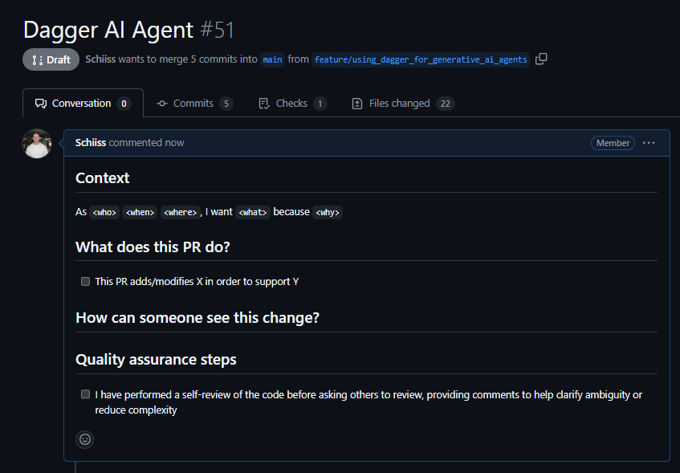
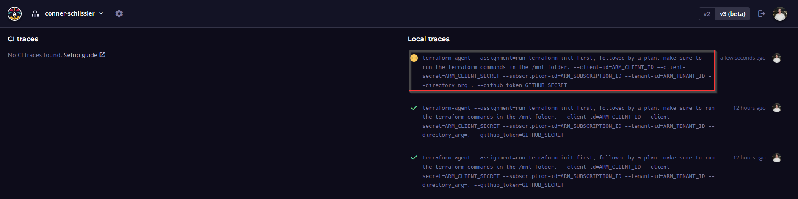
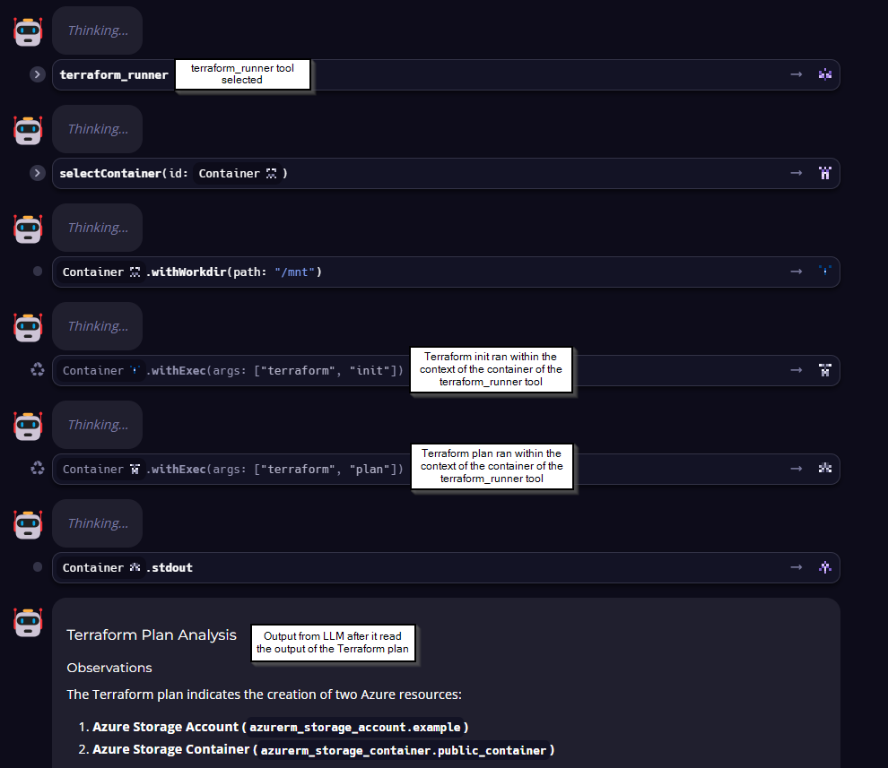
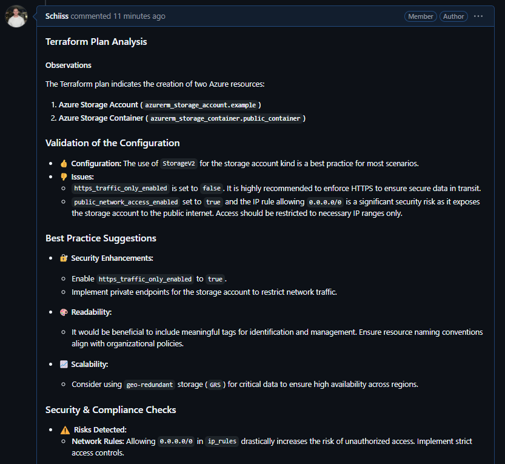

# 🌍 Real-World Example: Dagger Agents and Terraform

In the below example, we will create a Dagger pipeline that will run a Terraform plan, have an AI agent provide feedback from a security and best practices standpoint, and append that feedback to a PR for review. Agents are difficult to build and even more difficult to productionize. Dagger claims to provide 'a way to build reproducible workflows in any language with custom environments, parallel processing, and seamless chaining'.

This has lots of promise and as we will see in the use case below, could really help platform engineers and developers alike review PR’s much faster if an AI agent could give a summary of potential pitfalls of merging a change into the `master` branch.

Lets explore how Dagger can help build AI agents in a platform engineering context!

## 🎯 Expected Outcomes

✅ Terraform initializes and runs a plan.

✅ AI agent validates and provides feedback on Terraform Plan.

✅ AI agent findings are appended to the PR for review.

✅ View traces in **Dagger Cloud**.

✅ Decrease PR review times.

## 🔨 Implementation

The below steps were taken to leverage Daggers LLM integration capabilities. All the code for the below can be found [here](./ai_agent_dagger_pipeline/).

Make sure you have the repo cloned and you are in the `docs\dagger\agent-example` directory:

```bash
# Clone the repository from GitHub
git clone https://github.com/codetocloudorg/platform-engineering.git

# Change directory to the AI Agent Dagger pipeline documentation folder
cd ./docs/dagger/ai_agent_dagger_pipeline
```

### Step 1: Create Intentionally Poor Terraform File

First, we need to create the base Terraform configuration file that will deploy an Azure Blob Storage Account and a container to an existing resource group. This will be our main.tf file in the root of the dagger folder (ie: `docs\dagger\agent-example\main.tf`).

```terraform
terraform {
  required_providers {
    azurerm = {
      source  = "hashicorp/azurerm"
      version = "4.26.0"
    }
  }
}

provider "azurerm" {
  resource_provider_registrations = "none"
  features {}
}

resource "azurerm_storage_account" "example" {
  name                     = "daggertestingsa123"
  resource_group_name      = "dagger" # 🔴 Hardcoded RG name
  location                 = "East US"
  account_tier             = "Standard"
  account_replication_type = "LRS"

  https_traffic_only_enabled = false # 🔴 Insecure: allows HTTP

  public_network_access_enabled = true # 🔴 Open to the internet

  network_rules {
    default_action = "Allow"       # 🔴 Very permissive
    ip_rules       = ["0.0.0.0/0"] # 🔴 Everyone has access
    bypass         = ["AzureServices"]
  }

  tags = {
    environment = "test" # 🔴 Incomplete tagging, no owner/security tags
  }
}

resource "azurerm_storage_container" "public_container" {
  name                  = "public"
  storage_account_id    = azurerm_storage_account.example.id
  container_access_type = "blob" # 🔴 Public anonymous read access
}
```

You will notice in the comments we have **intentionally added some poor Terraform practices into our code**. This is to test the capability of the AI agent and see if it is able to flag them.

For example, we have set our container to public access with anonymous read access. This means anyone on the public internet can read the files in that container anonymously 😬.

### Step 2: Initialize Dagger for our AI Agent 🤖🗡️

Similar to the first [real-world example](../terraform-example/README.md) where we Daggerized a Terraform file, we have to do the same here to get going.

The only difference here is we will login to the **Dagger Cloud** which provides us with a a web interface to visualize each step of your workflow, drill down to detailed logs, understand how long operations took to run, and whether operations were cached.

This is very handy for AI agents since they can be notoriously challenging to troubleshoot. More on Dagger Cloud later!

```bash
# Initialize a new module at the given path
dagger init --sdk=python --name=agent_example --source=./ai_agent_dagger_pipeline

# Login to Dagger Cloud
dagger login
```

This will create our new Dagger project and link it to the cloud.

### Step 3: Implement our AI Agent ⚙️

In the `main.py` file that was generated by the Dagger CLI (locate at: `docs\dagger\agent-example\ai_agent_dagger_pipeline\src\agent_example\main.py`), we need to make some code changes to get our AI agent working. As mentioned earlier, we are going to have an AI agent assess our Terraform Plan file to identify any opportunities for improvement. In theory this should assist the PR reviewer since the AI agent is essentially summarizing/doing what a good PR reviewer should be doing prior to approving it. That is doing things like checking for security vulnerabilities in the infrastructure to be provisioned or making sure we are adding proper tags to our resources.

In the code below you will notice two functions:

1. `comment_on_pr()` – adds the AI agent output as a comment to an exisitng PR.
2. `terraform_agent()` – The AI agent implemented in Dagger. The agent has access to one tool called ‘terraform_runner’ which runs on a Terraform docker image and enables the agent to run Terraform commands like init and plan.

The code below is commented to assist you in understanding the implementation.

**Dagger AI Agent Python Implementation** 🤖⚒️

```python
import dagger
from dagger import dag, function, object_type

@object_type
class AgentExample:
    """
    Dagger object representing an example agent that can:
    - Comment on a GitHub pull request.
    - Execute a Terraform job in a containerized environment and analyze its output.
    """

    async def comment_on_pr(
        self,
        repo: str,
        comment_body: str,
        github_token: dagger.Secret,
    ) -> str:
        """
        Comments on the latest pull request authored by the authenticated user in the specified GitHub repository.

        Args:
            repo (str): The GitHub repository in the format 'owner/repo'.
            comment_body (str): The text content of the comment to post.
            github_token (dagger.Secret): GitHub personal access token with repo permissions.

        Returns:
            str: The standard output from the container after commenting.
        """
        container = (
            dag.container()
            .from_("alpine:latest")
            .with_secret_variable("GITHUB_TOKEN", github_token)
            # Install required tools
            .with_exec(["apk", "add", "--no-cache", "curl", "bash", "git", "openssl"])
            # Download and install GitHub CLI (gh)
            .with_exec([
                "sh", "-c",
                (
                    "curl -fsSL https://github.com/cli/cli/releases/download/v2.70.0/gh_2.70.0_linux_amd64.tar.gz "
                    "| tar -xz && mv gh_2.70.0_linux_amd64/bin/gh /usr/local/bin/"
                )
            ])
            # Clone the specified GitHub repository
            .with_exec(["git", "clone", f"https://github.com/{repo}.git"])
            # Set the working directory to the cloned repo
            .with_workdir(repo.split("/")[-1])
            # Create a temporary markdown file with the comment
            .with_new_file("/tmp/comment.md", contents=comment_body)
            # Post a comment on the latest PR authored by the user
            .with_exec([
                "sh", "-c",
                (
                    "PR_NUMBER=$(gh pr list --author \"@me\" --limit 1 --json number --jq '.[0].number') && "
                    f"gh pr comment $PR_NUMBER --body-file /tmp/comment.md --repo {repo}"
                )
            ])
        )

        # Return container output (e.g., result or logs)
        return await container.stdout()

    @function
    async def terraform_agent(
        self,
        assignment: str,
        directory_arg: dagger.Directory,
        client_id: dagger.Secret,
        client_secret: dagger.Secret,
        subscription_id: dagger.Secret,
        tenant_id: dagger.Secret,
        github_token: dagger.Secret
    ) -> str:
        """
        Executes a Terraform job using credentials and a directory of Terraform configurations,
        then comments the AI-analyzed result on a GitHub PR.

        Args:
            assignment (str): Description or title of the assignment.
            directory_arg (dagger.Directory): Directory containing the Terraform configuration.
            client_id (dagger.Secret): Azure client ID for Terraform.
            client_secret (dagger.Secret): Azure client secret for Terraform.
            subscription_id (dagger.Secret): Azure subscription ID for Terraform.
            tenant_id (dagger.Secret): Azure tenant ID for Terraform.
            github_token (dagger.Secret): GitHub token for posting the comment.

        Returns:
            str: The final analyzed result of the Terraform job.
        """
        # Set up the environment for Terraform execution
        environment = (
            dag.env()
            .with_string_input("assignment", assignment, "the assignment to complete")
            .with_container_input(
                "terraform_runner",
                dag.container()
                    .from_("hashicorp/terraform:1.11")
                    .with_mounted_directory("/mnt", directory_arg)
                    .with_workdir("/mnt")
                    .with_secret_variable("ARM_CLIENT_ID", client_id)
                    .with_secret_variable("ARM_CLIENT_SECRET", client_secret)
                    .with_secret_variable("ARM_SUBSCRIPTION_ID", subscription_id)
                    .with_secret_variable("ARM_TENANT_ID", tenant_id)
                    # Initialize and plan Terraform configuration
                    .with_exec(["terraform", "init"])
                    .with_exec(["terraform", "plan"]),
                "a container to use for running the terraform init & plan"
            )
            .with_container_output(
                "completed", "the completed assignment in the Terraform container"
            )
        )

        # Use an LLM to analyze the Terraform results
        analyze_results = (
            dag.llm()
            .with_env(environment)
            .with_prompt_file(dag.current_module().source().file("terraformer_prompt.txt"))
        )

        # Comment the LLM's last reply on a GitHub pull request
        await self.comment_on_pr("codetocloudorg/platform-engineering", await analyze_results.last_reply(), github_token)

        # Return the analyzed result
        return await analyze_results.last_reply()
```

**How This Works** 🤖✨

1️⃣ **Automated GitHub PR Commenting** 🗨️

- The `comment_on_pr` function uses the **GitHub CLI (`gh`) inside a container** to programmatically **comment on the latest pull request** authored by the user.
- It starts from a minimal `alpine` base image and installs necessary tools (`curl`, `bash`, `git`, `openssl`) as well as the **GitHub CLI**.
- The container:
  - Clones the specified GitHub repo.
  - Searches for the most recent PR opened by the user using `gh pr list`.
  - Posts the provided comment (`comment_body`) via `gh pr comment`.
- A `dagger.Secret` is used to securely inject the **GitHub token**, ensuring it's **never exposed in logs**.

2️⃣ **Containerized Terraform Execution with AI Review** 🤯🛠️

- The `terraform_agent` function executes a Terraform job inside a container and then uses an LLM to **analyze the results**.
- It builds a specialized `hashicorp/terraform:1.11` container to:
  - Mount the user-provided Terraform config directory at `/mnt`
  - Inject all necessary **Azure credentials** (`ARM_CLIENT_ID`, `ARM_CLIENT_SECRET`, `ARM_SUBSCRIPTION_ID`, `ARM_TENANT_ID`) securely using Dagger secrets.
  - Run `terraform init` and `terraform plan` to **preview infrastructure changes**.
- All steps happen in an **isolated, reproducible container**, making it consistent across developer machines and CI/CD systems.

3️⃣ **AI-Powered Output Interpretation** 🧠📋

- The output of the Terraform plan is passed to an **LLM environment**, which:
  - Uses a predefined `terraformer_prompt.txt` prompt template.
  - Generates a **natural language summary or analysis** of the Terraform output.
- Finally, the AI-generated summary is **posted as a comment** on a GitHub pull request using the earlier `comment_on_pr` function.
- This provides a **human-readable, intelligent insight** into the changes proposed by the Terraform config—right inside your GitHub workflow.

### Step 4: Running the Dagger AI Agent Locally 🤖🧑‍💻

To make sure this all works, we have to set a few environment variables in our terminal. This will allow our Dagger agent to interact with Azure to generate our Terraform plan and GitHub to create a comment on an existing PR.

```powershell
$ENV:ARM_TENANT_ID = "your_tenant_id"                        
$ENV:ARM_CLIENT_ID = "your_client_id"
$ENV:ARM_CLIENT_SECRET = "your_client_secret"                          
$ENV:ARM_SUBSCRIPTION_ID = "your_subscription_id"  
$ENV:GITHUB_SECRET = "git_pat"
```

Dagger supports a few [LLM providers](https://docs.dagger.io/configuration/llm) out of the box. I decided to use Azure OpenAI and there is a sample .env file you can fill out if you decide to do the same (ie: `docs\dagger\agent-example\.env.sample`). Otherwise, consult with the LLM provider documentation to integrate with your LLM of choice.

We also need to open a PR so the AI agent can leave a comment on it:



Let’s now run our Dagger agent locally by leveraging the Dagger CLI and using the `call` command.

```bash
dagger call terraform-agent --assignment="run terraform init first, followed by a plan. make sure to run the terraform commands in the /mnt folder." --client-id="ARM_CLIENT_ID" --client-secret="ARM_CLIENT_SECRET" --subscription-id="ARM_SUBSCRIPTION_ID" --tenant-id="ARM_TENANT_ID" --directory_arg=. --github_token="GITHUB_SECRET"
```

This will kickoff our Dagger pipeline and we can monitor it in real time in [Dagger Cloud](https://dagger.cloud/).



Opening that trace reveals some handy logging messages that allow us to drill down into what the agent actually did. Here are a few examples:

- Our prompt from our `terraformer_prompt.txt` file along with the assignment we passed through when we leveraged `dagger call` to invoke our agent.


- The tools/actions the AI agent took to complete the assignment.



These traces are really valuable both when you are trying to get an agent do exactly what you need it to and for troubleshooting **when** things go wrong.

Jumping back over to the PR, we can see the agent has created a comment for us with some recommendations for our Terraform.



### Step 5: Validating the AI Agent Recommendations 🤖✅

Our AI agent provided the following output based on it’s analysis of the Terraform plan:

```md
### Terraform Plan Analysis

#### Observations

The Terraform plan indicates the creation of two Azure resources:

1. **Azure Storage Account (`azurerm_storage_account.example`)**
2. **Azure Storage Container (`azurerm_storage_container.public_container`)**

### Validation of the Configuration

- **👍 Configuration:** The use of `StorageV2` for the storage account kind is a best practice for most scenarios.
- **👎 Issues:** 
  - `https_traffic_only_enabled` is set to `false`. It is highly recommended to enforce HTTPS to ensure secure data in transit.
  - `public_network_access_enabled` set to `true` and the IP rule allowing `0.0.0.0/0` is a significant security risk as it exposes the storage account to the public internet. Access should be restricted to necessary IP ranges only.

### Best Practice Suggestions

- **🔐 Security Enhancements:**
  - Enable `https_traffic_only_enabled` to `true`.
  - Implement private endpoints for the storage account to restrict network traffic.
  
- **🎨 Readability:**
  - It would be beneficial to include meaningful tags for identification and management. Ensure resource naming conventions align with organizational policies.
  
- **📈 Scalability:**
  - Consider using `geo-redundant` storage (`GRS`) for critical data to ensure high availability across regions.

### Security & Compliance Checks

- **⚠️ Risks Detected:**
  - **Network Rules:** Allowing `0.0.0.0/0` in `ip_rules` drastically increases the risk of unauthorized access. Implement strict access controls.

### Resource Optimization

- **💡 Optimization Tips:**
  - Review the `access_tier` and storage redundancy options (`LRS` vs `GRS`) based on usage patterns to potentially lower costs.
  - Consider enabling data lifecycle management policies to automatically delete or archive old data.

### Warnings

- **🚨 Potential Issues:**
  - **Public Exposure:** Resources exposed to public internet without secure protocols could lead to data breaches.
 
### Summary & Recommendations

- **Enhance security** by enforcing HTTPS and revisiting the public network access rules.
- **Restrict public exposure** by using private endpoints and refining IP rules.
- **Consider cost optimization strategies** by selecting appropriate access tiers and enabling lifecycle management.
- **Document configurations** thoroughly to improve future maintainability.
  
#### Next Steps

- Implement the recommended changes in the Terraform configuration.
- Conduct a security review post-implementation to ensure compliance.
- Monitor the deployed resources for any anomalies.

Sample Terraform update to enable HTTPS-only:
```hcl
resource "azurerm_storage_account" "example" {
  ...
  https_traffic_only_enabled = true
  network_rules {
    default_action = "Deny"
    ip_rules      = ["<your-ip-range>"] # Replace with specific IP range
  }
  ...
}

These updates will strengthen the security and efficiency of your infrastructure, adhering to best practices.
```

Are these recommendations valid? I think so. Here is a breakdown:

## ✅ Validation of AI Agent Recommendations

Below is a breakdown of each AI generated recommendation compared to our Terraform configuration.

### 🔒 `https_traffic_only_enabled = false`

- **AI said**: This should be `true` to enforce HTTPS.
- **Our code**: Has it set to `false`.
- ✅ **Valid Recommendation** – allowing HTTP is insecure and not recommended.

### 🌐 `public_network_access_enabled = true` with `ip_rules = ["0.0.0.0/0"]`

- **AI said**: This is a major security risk.
- **Our code**: Is wide open to the internet.
- ✅ **Valid Recommendation** – this effectively exposes your storage account to the public.

### 🛑 `network_rules.default_action = "Allow"`

- **AI said**: This is too permissive.
- **Our code**: Allows all by default.
- ✅ **Valid Recommendation** – best practice is to default to `"Deny"` and explicitly allow trusted sources.

### 📂 `container_access_type = "blob"`

- **AI said**: This allows public anonymous read access.
- **Our code**: Sets the container to public blob access.
- ✅ **Valid Recommendation** – unless there's a clear business reason, this should be private.

### 🏷️ Incomplete tagging

- **AI said**: Tags are missing key metadata like owner or classification.
- **Our code**: Only has `environment = "test"`.
- ✅ **Valid Recommendation** – minimal tagging is insufficient for governance and cost tracking.

### 🌍 GRS vs LRS

- **AI said**: Consider `GRS` for high availability.
- **Our code**: Uses `LRS` (local redundancy).
- ✅ **Valid Suggestion** – this improves resiliency, especially for critical workloads.

### 🧹 Lifecycle policies

- **AI said**: Add rules to delete/archive old data.
- **Our code**: No lifecycle management included.
- ✅ **Valid Suggestion** – helpful for cost optimization and managing storage bloat.

### ✅ Summary

Every recommendation made by the AI:

- Matches a **real issue or configuration gap**.
- Follows Azure and Terraform best practices.
- Would **improve security, governance, and maintainability**.

---

## 🎯 Final Outcome

By combining **containers, secure secrets, infrastructure automation**, and **AI-based review**, this Dagger setup enables a powerful GitOps loop that’s both **secure and intelligent**. Perfect for modern platform engineering and DevSecOps pipelines.

✅ **Automated GitHub PR Commenting**: The agent automatically commented on the latest GitHub pull request with insights and recommendations based on the Terraform plan.

✅ **Containerized Terraform Execution**: We utilized Dagger to execute Terraform commands in an isolated environment, ensuring reproducibility and security.

✅ **AI-Powered Output Interpretation**: After running the Terraform commands, the agent leveraged a LLM to analyze the plan and generate human-readable feedback, highlighting areas of improvement and potential risks.

✅ **Dagger Cloud Integration**: The entire process was monitored in real-time via Dagger Cloud, offering useful logging and troubleshooting insights.
