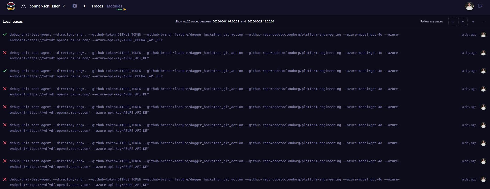
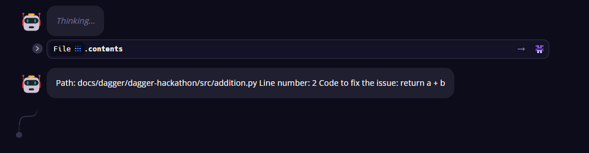
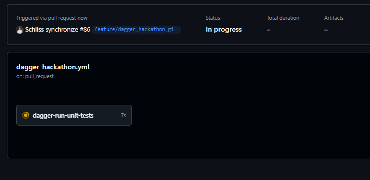

# 🧑‍💻 Dagger Hackathon: June 18th, 2025

Welcome to the Dagger hackathon hosted by the CNCF and Code to Cloud! By the end of this hack, you will have a good understanding of how to use Dagger and the various use cases it can help support.

## 🎯 Expected Outcomes

✅ Build a real-world use case with Dagger

✅ Dagger pipeline runs unit tests

✅ Dagger pipeline triggers LLM workflow if tests fail

✅ LLM provides code suggestion to fix failing unit tests

✅ Code suggestion is added to PR

## ✅ Prerequisites

There are two options for this hackathon. We highly recommend the first option to avoid dependency issues.

### 1️⃣ Option 1: Github Codespace

See Getting Started

### 2️⃣ Option 2: Local

Make sure to follow the prerequisites defined [here](../README.md) in the main Dagger README.

## 🔨 Getting Started

---

### ✅ Step 1: Create a Dagger Cloud Account

- [Register for a account](https://dagger.io/cloud)  
- Under settings, create a `DAGGER_CLOUD_TOKEN` and copy the secret password somewhere temporary

> **Note:** This will be used to enable logging on the Dagger pipeline. Logs can be viewed in [Dagger Cloud](https://dagger.io/cloud) after step 5

---

### ✅ Step 2: Fork This Repository

- Create a fork of this repository to your personal GitHub account  
  If you already have a fork, either rebase to this repository or, if you don't have any work you want to keep, just delete and recreate.

- In the UI, create a new feature branch off `main`

---

### ✅ Step 2: Setup Codespace *(if you are setting up locally skip to Step 3)*

- In the GitHub UI, change to the newly created feature branch  
- Create a codespace on the feature branch  

  

- This will auto-open VS Code in browser. If you don't want to work from here and have the VS Code app installed, you can close this and open it in the app  

  

---

### ✅ Step 3: Setup Locally *(if you did Step 2 then skip to Step 4)*

#### 🔧 Install required prerequisites

- Python 3.11+  
- [Docker Desktop](https://www.docker.com/products/docker-desktop/) or another container runtime (e.g. Colima on macOS and Linux)  
- [Dagger CLI](https://docs.dagger.io/install/)

#### 🔧 Additional Setup

- Start your container runtime  
- Clone the forked repository locally and switch to the newly created feature branch  

---

### ✅ Step 4: Break Some Code and Open A PR

- Open a terminal  
- Create an environment variable for `DAGGER_CLOUD_TOKEN`, e.g.  
  ```bash
  export DAGGER_CLOUD_TOKEN="XXX"
  ```
- Change directory into `docs/dagger/dagger-hackathon/`  
- Open the file `docs/dagger/dagger-hackathon/src/addition.py` and break the function  
  For example, modify to: `return a + b * 4`  
- Run the unittests  
  ```bash
  python -m unittest discover tests -v
  ```
  and confirm it fails  
- Push the modified `addition.py` to your new feature branch  
- In the GitHub UI, open a PR on the feature branch and compare to `main`

---

### ✅ Step 5: Run The Fix My Tests Agent

- Rename `docs/dagger/dagger-hackathon/.env-example` to `.env`  
- Populate the placeholder keys with real values (we will provide for Hackathon day)  
- Create environment variables for `GITHUB_TOKEN` and `AZURE_API_KEY`  
  A GitHub Token can be created in GitHub under Settings → Developer Settings → Create a classic token  
  Example:
  ```bash
  export GITHUB_TOKEN="XXX"
  ```

- Put in your values and run in CLI:
  ```bash
  dagger call \
    --source="." \
    --github_branch="BRANCH-NAME" \
    --github_repo="USERNAME/REPO-NAME" \
    --github_token="GITHUB_TOKEN" \
    --azure_api_key="AZURE_API_KEY" \
    --azure_endpoint="PATH" \
    fix-my-tests-agent
  ```

- If you see an error, it might be that the Agent has hallucinated — try again  
  You can also debug via the Dagger Traces in Dagger Cloud

---

### ✅ Step 6: Explore Dagger Traces

Being able to navigate and explore logs in Dagger Cloud is a great skill to have to be able to effectively troubleshoot and build pipelines in Dagger. Now that we have ran our first command in Dagger, lets jump into the logs to see what happened.

- Navigate to [Dagger Cloud](https://dagger.io/cloud)
- You should see your trace(s)



- Select a trace and explore the logs
- If all has gone well, you should see something like this at the bottom of the trace detailing the problematic file, line number, and fix for the failing unit test.



---

### ✅ Step 7: Confirm The Agent Fixed the Code

- If the Agent finished successfully, you should see something like below in the CLI
  ```
  AgentResponse(pr_metadata=PrMetadataResult(pr_number='1', commit_id='c4293304b9fdccf2022e7e15e09e5b1604cecf04'), pr_suggestions=GitHubPrSuggestionResult(body='```suggestion\nreturn a + b\n```', comment_url='https://github.com/david-hurley/platform-engineering/pull/1#discussion_r2127910154'))
  ```
- Click the PR URL and see if there is a suggested code change

---

### ✅ Step 8: Trigger GitHub Action

- Delete the comment the Agent left on the PR in Step 6  
- [Create GitHub secrets](https://docs.github.com/en/actions/security-for-github-actions/security-guides/using-secrets-in-github-actions#creating-secrets-for-a-repository) for everything in `.env` and name them `DAGGER_HACKATHON_GITHUB_TOKEN` and `OPENAI_API_KEY` for the GitHub token and Azure OpenAI API key respectively.
- Make sure to update your GitHub Action to trigger on a pull request instead of a manual trigger.

Update the trigger from this:

```yaml
on:
  workflow_dispatch:
```

To this:
```yaml
on:
  pull_request:
    branches: [main]
    types: [opened, synchronize, reopened]
```

- Push your changes to Git and navigate back to your forked repo to see the GitHub Action running



---

## ⚠️ Gotchas and Future Improvements

- The agent can sometimes return incorrect paths to the file with breaking changes, incorrect line number of the breaking change, or incorrect fix (e.g. too verbose)  
- Current state of this does not work with multi-line code changes or multiple breaking changes.  
  Only supports **1 breaking change on 1 line**  
- The way commit ID is retrieved is not robust — if a breaking change is pushed to a branch with an open PR and it is commit ID A, and then another file is pushed (commit ID B),  
  the code is setup to grab the **latest commit ID**, not the one with the breaking change  
  This may result in failure (i.e. no diff)
