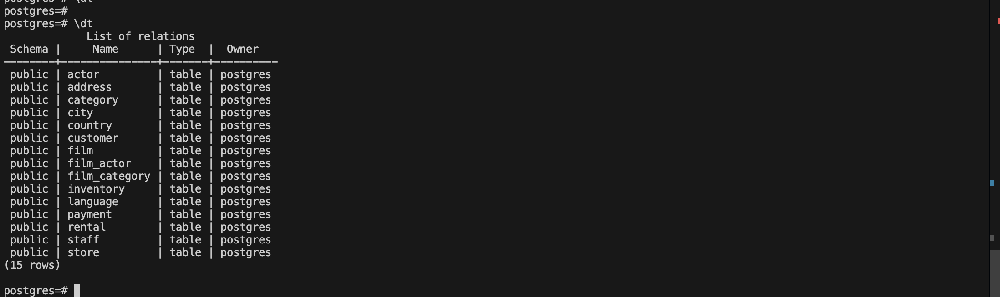
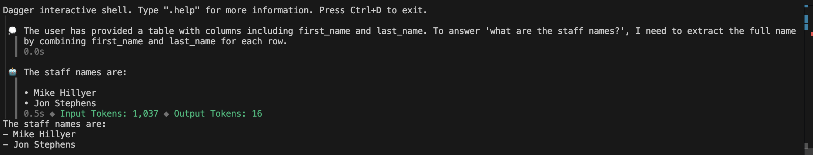

### How to Run This using Codespaces
1. Clone or Fork (for outside org users) repo
2. From cloned/forked repo, select `code -> codespaces -> create`
This will use the existing `devcontainer` configuration to create/install:
- python
- postgresql
- dagger cli
- Docker and Docker Extension for VSCode
- seeds sample data to postgresql
- sets up postgres credentials

Inside the devcontainer you can run the following to check for correct setup:

`python --version` -> should see 3.12

`Docker --version` -> should get response

`type dagger` -> should get path

`which psql` -> should get path

`psql -h localhost -U postgres -d postgres` -> this start interactive psql `\q` to exit. Run `\dt` to see that tables are setup. Run `select * from staff;` to see that tables are seeded. 

If using existing code then do not run below command and proceed to step 4. Otherwise run this command and modify `main.py` and `pyproject.toml` 

3. Run `dagger init --sdk=python --name=agent_database_example --source=./ai_database_agent_dagger_pipeline` to scaffold new project

4. duplicate `.env.sample` and rename as `.env` and input your OpenAI API key

5. `cd` into this directory, start dagger shell `dagger`

6. run `ask-agent tcp://localhost:5432 "staff" "what are the staff names?"`, you should see output like below:

