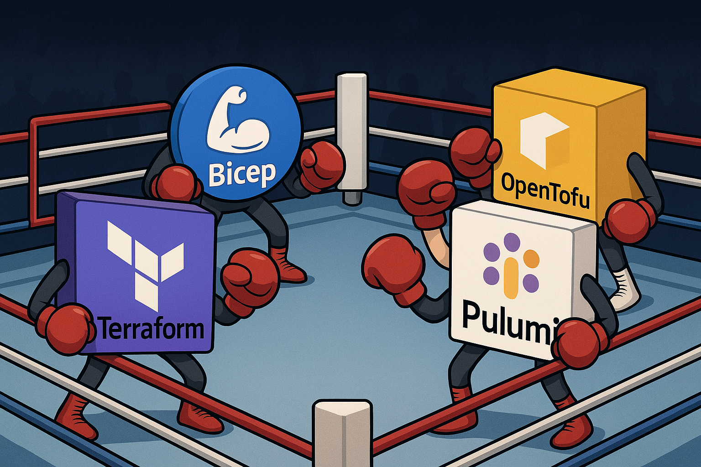

# 🚀 Getting Started with Infrastructure as Code (IaC): A Platform Engineer’s Guide

Hey there, Platform Engineers! 👷‍♀️👷‍♂️

Welcome to your go-to guide on **Infrastructure as Code (IaC)**, a foundational practice for scalable, secure, and efficient infrastructure management.

If you've ever found yourself thinking *“There has to be a better way to manage this infrastructure…”* — you're absolutely right. Welcome to the world of **Infrastructure as Code (IaC)**! 🧑‍💻💻

This post is your 🔑 to understanding what IaC is, why it matters, and how to choose the right tool for the job.

---

## 📘 What is Infrastructure as Code (IaC)?

Infrastructure as Code is the practice of managing and provisioning cloud infrastructure **using code instead of manual processes**. Instead of clicking around cloud dashboards (yikes 😬), you define infrastructure like virtual machines, networks, storage, and more, all in code!

Think of IaC as treating your infrastructure the same way you treat application code: you write it, version it, test it, and deploy it using best practices from the world of software engineering.

### 🧠 Why is IaC Essential for Platform Engineering?

As a platform engineer, you're often responsible for creating scalable, reliable, and repeatable systems that other teams build on. IaC provides a **systematic, scalable**, and **repeatable** approach to managing that foundation.

- 🛠️ **Standardization**: Ensure consistent environments across dev, staging, and prod.
- 🧪 **Testability**: Validate changes in CI pipelines before applying them.
- 🔁 **Repeatability**: Spin up identical environments on demand.
- 🔒 **Security**: Apply policies-as-code and audit changes via Git history.
- 🔧 **Troubleshooting**: Roll back to a previous known-good state.
- 📦 **Reusability**: Package common infra patterns as reusable modules for your team.

IaC helps platform engineers do **more with less**, move **faster with fewer errors**, and **build platforms that scale**, both technically and organizationally.

---

## ✅ The Benefits of IaC

Let’s break down why adopting Infrastructure as Code (IaC) is a no-brainer for modern platform engineering:

| Benefit           | Description |
|------------------|-------------|
| 🤖 **Automation** | Say goodbye to manual clicks — deploy entire environments with a single command. |
| 📏 **Consistency** | Ensure environments look the same every time, across dev, staging, and prod. |
| 🕓 **Speed** | Spin up resources in minutes, not hours or days. |
| 📝 **Version Control** | Store your infrastructure code in Git, track changes, and roll back safely. |
| 🧩 **Modularity** | Create reusable modules to speed up future projects. |

IaC makes your infrastructure **reliable, scalable, and manageable**, just like any good piece of software.

---

## 🔁 Declarative vs. Imperative IaC

There are two main philosophies in the IaC world:

### 📜 Declarative (What to achieve)

You define the **desired state** of your infrastructure. The tool figures out how to get there.

> Example: "I want a VM in region X with Y GB of RAM."

- **Tools**: Terraform, OpenTofu, Bicep

✅ Easier to maintain  
✅ Better for drift detection  
✅ Tools: Terraform, Bicep, OpenTofu  

---

### 🧮 Imperative (How to achieve it)

You write **step-by-step instructions** to build infrastructure.

> Example: "Create a resource group, then create a VM, then install nginx."

- **Tools**: Pulumi, Ansible, scripting (e.g., Bash or Python)

✅ More control  
✅ Familiar for software developers  
✅ Tools: Pulumi (with code), Ansible (scripts)

---

## 🛠️ Popular IaC Tools (and When to Use Them)

Choosing an IaC tool is a bit like building a table: 🪑🔨 

You wouldn’t build a table using just a hammer, right? You need **different tools** for different parts. A saw to cut, a drill to assemble, a level to make sure it’s even.

The same applies to Infrastructure as Code. There’s no single "best" tool, but rather the **right tool for the job** depending on your use case, team skills, and cloud ecosystem.

Let’s break it down:

---

### 🌍 Terraform

- **Type**: Declarative  
- **Language**: HCL (HashiCorp Configuration Language)  
- **Strengths**: Mature ecosystem, vast provider support, cloud-agnostic, strong community, modular structure  

#### 🧰 When to Use Terraform

Use Terraform when you want **a reliable, cross-cloud workhorse**. It’s like your electric drill, versatile, powerful, and works with many attachments (cloud providers). Perfect for teams who want **standardization** across AWS, Azure, GCP, and more.

#### 🌍 Ideal for

- Multi-cloud or hybrid environments  
- Teams looking for a well-documented and widely adopted tool  
- Creating reusable modules for consistent infrastructure patterns

🔗 [terraform.io](https://www.terraform.io)

---

### 🌱 OpenTofu

- **Type**: Declarative  
- **Language**: HCL (Terraform-compatible)  
- **Strengths**: Fully open-source, community-driven, no licensing constraints  

#### 🧰 When to Use OpenTofu

Think of OpenTofu as your **open-source screwdriver**, simple, familiar, and doesn’t lock you into a specific brand. Great for teams who love Terraform but want to avoid proprietary licensing or maintain full control over the source code.

#### 🌱 Ideal for

- Open-source enthusiasts and contributors  
- Companies with strict OSS or compliance requirements  
- Projects where long-term cost and transparency matter

🔗 [opentofu.org](https://opentofu.org)

---

### 🧑‍💻 Pulumi

- **Type**: Imperative  
- **Language**: TypeScript, Python, Go, .NET, Java  
- **Strengths**: Developer-friendly, integrates directly with programming languages, great for complex logic  

#### 🧰 When to Use Pulumi

Pulumi is your **smart multi-tool**, think Swiss Army knife 🧠. Ideal when you’re building a custom setup and need to blend infrastructure with real code. For instance, looping over dynamic data, embedding conditionals, or integrating APIs directly within your IaC logic.

#### 💡 Ideal for

- Developers who want to write infra using the same language as their apps  
- Complex applications with lots of conditional resources or dynamic behavior  
- Teams already working in modern CI/CD pipelines and want full code integration

🔗 [pulumi.com](https://www.pulumi.com)

---

### 🧱 Bicep

- **Type**: Declarative  
- **Language**: Bicep (DSL for Azure ARM templates)  
- **Strengths**: First-class Azure support, ARM simplification, clean syntax  

#### 🧰 When to Use Bicep

Bicep is like your **precision chisel**, tailor-made for a specific platform (Azure). It simplifies complex Azure templates, and offers tight native integration, like Azure Policy, RBAC, and Resource Groups. Perfect for teams fully committed to the Azure ecosystem.

#### 🧱 Ideal for

- Azure-native environments  
- Teams that want to move away from verbose ARM templates  
- Projects that need native integration with Azure DevOps or Microsoft governance tools

🔗 [learn.microsoft.com/bicep](https://learn.microsoft.com/en-us/azure/azure-resource-manager/bicep/)

---

## 🧭 Summary: Use the Right Tool for the Job

| Tool       | Type       | Best For |
|------------|------------|----------|
| **Terraform** | Declarative | Multi-cloud, modular infra, community plugins |
| **OpenTofu** | Declarative | Open-source purists, cost-sensitive projects |
| **Pulumi**   | Imperative  | Developers, dynamic infra, advanced logic |
| **Bicep**    | Declarative | Azure-native teams, simpler ARM replacements |

No single tool does it all, just like building a table, pick the right tools from your IaC toolbox 🧰 to make the process smooth, efficient, and tailored to your needs.

Ready to build your platform masterpiece? Pick your tools and start crafting! 🏗️💻

---

## 🎉 Final Thoughts

Infrastructure as Code is a **must-have** for modern platform engineering. It brings speed, consistency, and peace of mind 😌 to infrastructure management.

No matter where you are on your IaC journey, the tools and approaches above are ready to empower you to build better platforms, faster and safer 🚧⚡

---
